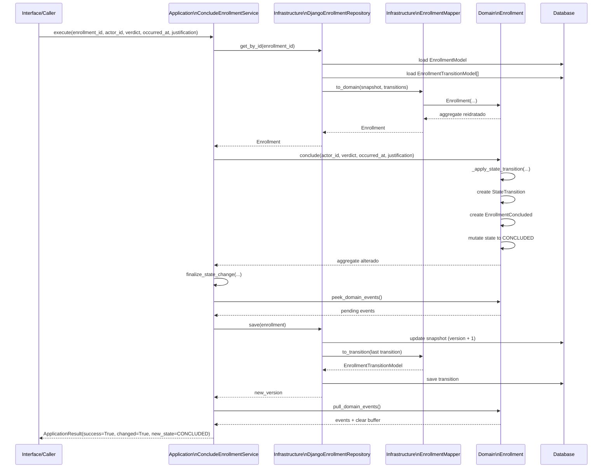

# Fluxo Tecnico - Concluir Matricula

## 1. Objetivo

Descrever a sequencia tecnica do caso feliz de conclusao de matricula, deixando explicito:

- em que camada cada metodo roda
- a ordem das chamadas principais
- onde a transicao de estado nasce
- onde a persistencia acontece
- quando os eventos de dominio sao limpos

Este documento complementa o caso de uso funcional de `concluir_matricula`.

---

## 2. Ponto de Entrada

O fluxo comeca na camada de **Application**, no service:

- `ConcludeEnrollmentService.execute(...)`

Responsabilidade:

- receber os parametros do caso de uso
- carregar o aggregate atual
- delegar a regra de negocio ao dominio
- finalizar a persistencia
- devolver `ApplicationResult`

---

## 3. Sequencia do Caso Feliz por Camada

### 3.1 Application

1. `ConcludeEnrollmentService.execute(...)`
2. chama `repo.get_by_id(enrollment_id)`

### 3.2 Infrastructure

3. `DjangoEnrollmentRepository.get_by_id(...)`
4. carrega `EnrollmentModel`
5. carrega `EnrollmentTransitionModel`
6. chama `EnrollmentMapper.to_domain(...)`

### 3.3 Infrastructure -> Domain mapping

7. para cada transicao persistida, instancia `StateTransition(...)`
8. instancia `Enrollment(...)`

### 3.4 Domain

9. `Enrollment.__post_init__()` valida o aggregate reidratado
10. `ConcludeEnrollmentService.execute(...)` chama `enrollment.conclude(...)`
11. `Enrollment.conclude(...)` valida:
   - estado atual
   - `verdict.is_allowed`
   - justificativa, quando exigida
12. `Enrollment.conclude(...)` chama `_apply_state_transition(...)`
13. `_apply_state_transition(...)`:
   - resolve `occurred_at`
   - cria `StateTransition`
   - cria `EnrollmentConcluded`
   - limpa timestamps anteriores
   - muda o `state` para `CONCLUDED`
   - define `concluded_at`
   - adiciona a transicao em `transitions`
   - adiciona o evento em `_domain_events`

### 3.5 Application

14. o service chama `finalize_state_change(...)`
15. `finalize_state_change(...)` verifica:
   - se o estado realmente mudou
   - se existem eventos pendentes
16. chama `repo.save(enrollment)`

### 3.6 Infrastructure

17. `DjangoEnrollmentRepository.save(...)`
18. entra em `transaction.atomic()`
19. atualiza o snapshot em `EnrollmentModel`
20. converte a ultima transicao com `EnrollmentMapper.to_transition(...)`
21. gera `transition_id` com `make_transition_id(...)`
22. persiste `EnrollmentTransitionModel`

### 3.7 Application + Domain

23. voltando ao fluxo compartilhado, `finalize_state_change(...)` chama `enrollment.pull_domain_events()`
24. o aggregate retorna e limpa os eventos pendentes
25. a Application devolve `ApplicationResult(success=True, changed=True, new_state=CONCLUDED)`

---

## 4. Onde a Transicao Realmente Nasce

A transicao de estado **nao nasce no repositorio**.

Ela nasce no **Domain**, dentro de:

- `Enrollment.conclude(...)`
- `Enrollment._apply_state_transition(...)`

Mais especificamente, a transicao passa a existir quando o dominio cria:

- o `StateTransition`
- o evento `EnrollmentConcluded`

So depois disso o aggregate muda seu estado interno.

O repositorio apenas persiste a ultima transicao ja produzida pelo dominio.

---

## 5. Ordem dos Metodos Principais

1. `ConcludeEnrollmentService.execute(...)`
2. `repo.get_by_id(...)`
3. `DjangoEnrollmentRepository.get_by_id(...)`
4. `EnrollmentMapper.to_domain(...)`
5. `StateTransition(...)`
6. `StateTransition.__post_init__()`
7. `Enrollment(...)`
8. `Enrollment.__post_init__()`
9. `Enrollment._validate_identity()`
10. `Enrollment._validate_institution_id()`
11. `Enrollment._normalize_and_validate_state()`
12. `Enrollment._validate_version()`
13. `Enrollment._normalize_datetimes()`
14. `Enrollment._validate_state_integrity()`
15. `Enrollment.conclude(...)`
16. `Enrollment._apply_state_transition(...)`
17. `Enrollment._occurred_at_or_now(...)`
18. `StateTransition(...)`
19. `StateTransition.__post_init__()`
20. `EnrollmentConcluded(...)`
21. `EnrollmentConcluded.__post_init__()`
22. `finalize_state_change(...)`
23. `enrollment.peek_domain_events()`
24. `repo.save(...)`
25. `DjangoEnrollmentRepository.save(...)`
26. `EnrollmentModel.objects.filter(...).update(...)`
27. `EnrollmentMapper.to_transition(...)`
28. `make_transition_id(...)`
29. `EnrollmentTransitionModel(...).save()`
30. `enrollment.pull_domain_events()`
31. `ApplicationResult(...)`

---

## 6. Diagrama de Sequencia

---

## 7. Garantias do Caso Feliz

Quando o fluxo termina com sucesso:

- o aggregate saiu de `ACTIVE` para `CONCLUDED`
- `concluded_at` foi preenchido
- a transicao foi anexada ao aggregate
- o evento `EnrollmentConcluded` foi registrado
- o snapshot foi atualizado com `version + 1`
- a ultima transicao foi persistida no log append-only
- os eventos de dominio so foram limpos depois da persistencia bem-sucedida

---

## 8. Observacoes Importantes

- A **Application** orquestra, mas nao cria a regra de negocio.
- O **Domain** decide se a conclusao e valida e cria a transicao.
- A **Infrastructure** persiste o snapshot e o log da transicao.
- O caso feliz depende da coerencia entre mudanca de estado e emissao de evento.
- O repositorio nao deve inventar uma transicao; ele apenas persiste a ultima transicao do aggregate.
